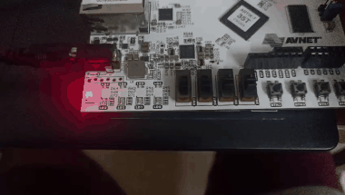
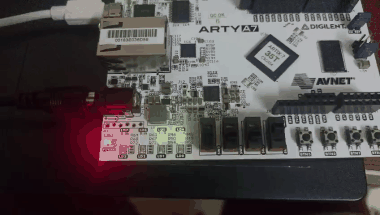
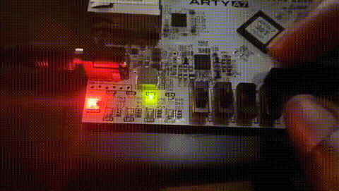
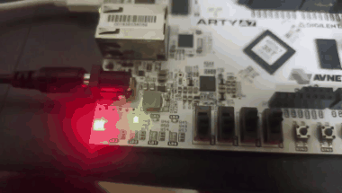
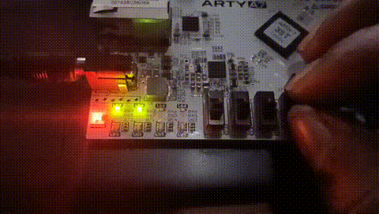

# Artix-7 LED Counter with Selectable Blink Speed


A Verilog design for the **Xilinx Artix-7 XC7A35T** FPGA that divides the on-board 100 MHz oscillator down to a slow clock `clkf` of **1, 2, 5 or 10 Hz** and uses it to drive a 4-bit binary counter on the LEDs. Two switches select the speed.

---

## Contents
- [Demo Videos](#demo-videos)
- [Features](#features)
- [How the Clock Division Works](#how-the-clock-division-works)
- [Frequency Table](#frequency-table)
- [Waveforms](#waveforms)
- [Ports](#ports)
- [Build and Run](#build-and-run)
- [Regenerating the Docs](#regenerating-the-docs-optional)
- [Design Notes](#design-notes)
- [Repository Structure](#repository-structure)
- [License](#license)

---

## Demo Videos

The speed name is the rate at which the counter **increments** (the frequency of `clkf`). LED0 is the least significant bit, so it blinks at half that rate.

| Mode | `freq[1:0]` | Counter increments at | LED0 blinks at | Hardware Demonstration |
| :---: | :---: | :---: | :---: | :---: |
| **1 Hz** | `00` | 1 Hz | 0.5 Hz |  |
| **2 Hz** | `01` | 2 Hz | 1 Hz |  |
| **5 Hz** | `10` | 5 Hz | 2.5 Hz |  |
| **10 Hz** | `11` | 10 Hz | 5 Hz |  |
| **All Speeds** | `00 → 01 → 10 → 11` | 1 → 2 → 5 → 10 Hz | 0.5 → 1 → 2.5 → 5 Hz |  |

---

## Features
- Four selectable speeds from the 100 MHz board clock using slide switches (`freq[1:0]`).
- 26-bit prescaler counter that divides the clock down to human-visible rates.
- Divided clock `clkf` of exactly 1, 2, 5 or 10 Hz.
- 4-bit binary up-counter shown on the LEDs.
- Hardware verified on a Xilinx Artix-7 FPGA board.

---

## How the Clock Division Works

The board oscillator runs at **100 MHz**, so one clock period is **10 ns**. That is far too fast to see on an LED, so the design counts clock cycles and toggles an internal slow clock `clkf` only once every $N$ cycles.

```
                    limit (chosen by freq[1:0])
                              │
                              ▼
100 MHz clk ──► [ 26-bit prescaler countr ] ──► toggle ──► clkf ──► [ 4-bit counter ] ──► LEDs
```

### What the code does
1. `countr` increments by 1 on every rising edge of `clk`.
2. When `countr` reaches `limit`, it resets to 0 and **toggles** `clkf`.
3. On every **rising** edge of `clkf`, the 4-bit `count` register increments by 1.
4. `count[0]` (LED0) toggles on every increment, `count[1]` on every second one, and so on. Each bit is a divide-by-2 of the one below it.

### Where do the `limit` numbers come from?

The Verilog code only contains the finished numbers (`49999999`, `24999999`, ...). They were **calculated in advance** with the steps below. The formula itself is not written in the code, it is how the numbers were found.

**Goal:** make `clkf` run at a chosen frequency $f$. Example: $f$ = 1 Hz.

| Step | Question | Calculation (example: 1 Hz) |
| :---: | :--- | :--- |
| 1 | How long is one `clk` cycle? | 1 / 100 MHz = **10 ns** |
| 2 | How long is one full `clkf` period? | 1 / 1 Hz = **1 s** |
| 3 | `clkf` must go high *and* low in one period, so it toggles twice per period. How long between toggles? | 1 s / 2 = **0.5 s** |
| 4 | How many `clk` cycles fit in 0.5 s? | 0.5 s / 10 ns = **50,000,000 cycles** |
| 5 | `countr` counts 0, 1, 2, ... up to `limit`. That is `limit + 1` counts, so subtract 1. | 50,000,000 − 1 = **49,999,999** |

Steps 1 to 4 combined give the general formula:

$$N = \frac{\text{CLK}_{\text{HZ}}}{2 \times f_{clkf}} \qquad\qquad \text{limit} = N - 1$$

**Why subtract 1?** Counting from 0, a counter that must take 5 cycles counts `0, 1, 2, 3, 4`. It reaches 4, not 5, so `limit = 5 - 1 = 4`.

**Why divide by 2?** One `clkf` period needs two toggles (up, then down). Without the 2, `clkf` would run at half the intended speed.

### The four values calculated

With $\text{CLK}_{\text{HZ}}$ = 100,000,000:

| `freq[1:0]` | Wanted `clkf` | $N = 100{,}000{,}000 \div (2 \times f)$ | `limit` = N − 1 |
| :---: | :---: | :---: | :---: |
| `00` | 1 Hz  | 100,000,000 ÷ 2  = 50,000,000 | **49,999,999** |
| `01` | 2 Hz  | 100,000,000 ÷ 4  = 25,000,000 | **24,999,999** |
| `10` | 5 Hz  | 100,000,000 ÷ 10 = 10,000,000 | **9,999,999** |
| `11` | 10 Hz | 100,000,000 ÷ 20 = 5,000,000  | **4,999,999** |

**Check in reverse:** with `limit = 49,999,999`, `clkf` toggles every 50,000,000 cycles (0.5 s), so its period is 1 s, which is 1 Hz.

### Optional: write the formula directly in the Verilog

Your code works as it is. This is only an alternative where the synthesis tool does the calculation for you. It gives identical values and makes it easy to change the clock or the target frequencies:

```verilog
localparam CLK_HZ = 100_000_000;

always @(*) begin
    case (freq)
        2'b00:   limit = CLK_HZ / (2 * 1)  - 1;   // 49,999,999
        2'b01:   limit = CLK_HZ / (2 * 2)  - 1;   // 24,999,999
        2'b10:   limit = CLK_HZ / (2 * 5)  - 1;   //  9,999,999
        2'b11:   limit = CLK_HZ / (2 * 10) - 1;   //  4,999,999
        default: limit = CLK_HZ / (2 * 1)  - 1;
    endcase
end
```

---

## Frequency Table

All values are for the 100 MHz on-board oscillator (10 ns period).

| `freq[1:0]` | `limit` | Cycles per `clkf` toggle | Toggle interval | `clkf` / counter rate | LED0 | LED1 | LED2 | LED3 |
| :---: | :---: | :---: | :---: | :---: | :---: | :---: | :---: | :---: |
| `00` | `49,999,999` | 50,000,000 | 500 ms | **1 Hz**  | 0.5 Hz | 0.25 Hz | 0.125 Hz | 0.0625 Hz |
| `01` | `24,999,999` | 25,000,000 | 250 ms | **2 Hz**  | 1 Hz | 0.5 Hz | 0.25 Hz | 0.125 Hz |
| `10` | `9,999,999`  | 10,000,000 | 100 ms | **5 Hz**  | 2.5 Hz | 1.25 Hz | 0.625 Hz | 0.3125 Hz |
| `11` | `4,999,999`  | 5,000,000  | 50 ms  | **10 Hz** | 5 Hz | 2.5 Hz | 1.25 Hz | 0.625 Hz |

The full 4-bit sequence (0 to 15) repeats every 16 counter increments: 16 s, 8 s, 3.2 s and 1.6 s respectively.

---

## Waveforms

Each mode has a diagram in two parts:

- **A) Zoom on the 100 MHz clock.** One cell is one clock cycle (10 ns). `countr` counts up on every clock edge. When it equals `limit`, `clkf` toggles on the next edge, and on a rising `clkf` edge `count` goes from `n` to `n+1`. The middle is cut out because millions of cycles cannot be drawn.
- **B) Resulting waveforms** of `clkf` and `count[3:0]` over the same 4 s of real time in every mode, so the speed differences are visible.

### Speed Selection Overview
LED0 in all four modes on the same 4-second time scale:


---

### 1 Hz Mode (`freq = 00`)
- **limit**: `49,999,999` (`clkf` toggles every 50,000,000 clock cycles)
- **`clkf` / counter rate**: 1 Hz
- **LED0 blink rate**: 0.5 Hz


---

### 2 Hz Mode (`freq = 01`)
- **limit**: `24,999,999` (`clkf` toggles every 25,000,000 clock cycles)
- **`clkf` / counter rate**: 2 Hz
- **LED0 blink rate**: 1 Hz


---

### 5 Hz Mode (`freq = 10`)
- **limit**: `9,999,999` (`clkf` toggles every 10,000,000 clock cycles)
- **`clkf` / counter rate**: 5 Hz
- **LED0 blink rate**: 2.5 Hz


---

### 10 Hz Mode (`freq = 11`)
- **limit**: `4,999,999` (`clkf` toggles every 5,000,000 clock cycles)
- **`clkf` / counter rate**: 10 Hz
- **LED0 blink rate**: 5 Hz


---

## Ports

| Port | Direction | Width | Description |
| :--- | :---: | :---: | :--- |
| `clk` | in | 1 | 100 MHz on-board oscillator |
| `freq` | in | 2 | Speed select (slide switches) |
| `count` | out | 4 | Binary counter, connect to LEDs |

---

## Build and Run

**Requirements:** Xilinx Vivado and an Artix-7 board with a 100 MHz oscillator (tested on Arty A7-35T).

1. Clone the repository:
   ```bash
   git clone https://github.com/pavan2415001/artix7-led-counter.git
   cd artix7-led-counter
   ```
2. Create a Vivado project for the Artix-7 XC7A35T.
3. Add `src/led.v` as a design source.
4. Add `constraints/arty_a7_35t.xdc` as a constraint source (use `constraints/constraints.xdc` as a generic template for other boards). It maps `clk`, `freq[1:0]` and `count[3:0]` to the board pins.
5. Make sure the XDC contains the clock constraint:
   ```tcl
   create_clock -add -name sys_clk_pin -period 10.000 -waveform {0 5} [get_ports clk]
   ```
6. Run Synthesis, Implementation, then Generate Bitstream.
7. Program the board, set the `freq` switches and watch the LEDs.

---

## Regenerating the Docs (optional)

Python 3 only, no extra packages needed for the SVG script.

```bash
python generate_svgs.py              # rebuilds docs/waveform_*.svg
python convert_videos_to_gifs.py     # converts videos/*.mp4 to videos/*.gif (needs FFmpeg)
```

The full-quality `.mp4` files are in `videos/` next to the GIFs.

---

## Design Notes

- `clkf` is generated in fabric logic and then used as a clock for `count`. This works on Artix-7 for an LED demo, but Vivado may report a warning about the generated clock. A common alternative is to keep everything on `clk` and use the terminal count as a clock enable.
- There is no reset input. `count` and `countr` start at 0 from their initial values when the bitstream is loaded.
- Changing `freq` while running takes effect immediately. `countr >= limit` handles the case where the new limit is lower than the current count.

---

## Repository Structure

```
artix7-led-counter/
├── README.md                    # Project documentation & timing diagrams
├── LICENSE                      # License
├── .gitignore
├── src/
│   └── led.v                    # Top Verilog module
├── constraints/
│   ├── arty_a7_35t.xdc          # Pin & clock constraints (Arty A7-35T)
│   └── constraints.xdc          # Generic constraints template
├── docs/
│   ├── waveform_overview.svg    # Comparison timing diagram
│   ├── waveform_1hz.svg         # 1 Hz mode timing diagram
│   ├── waveform_2hz.svg         # 2 Hz mode timing diagram
│   ├── waveform_5hz.svg         # 5 Hz mode timing diagram
│   └── waveform_10hz.svg        # 10 Hz mode timing diagram
├── videos/
│   ├── 1hz.mp4 / 1hz.gif        # 1 Hz demo
│   ├── 2hz.mp4 / 2hz.gif        # 2 Hz demo
│   ├── 5hz.mp4 / 5hz.gif        # 5 Hz demo
│   ├── 10hz.mp4 / 10hz.gif      # 10 Hz demo
│   └── all.mp4 / all.gif        # All speeds demo
├── generate_svgs.py             # Script to generate the SVG diagrams
└── convert_videos_to_gifs.py    # Script to convert MP4 videos to GIFs
```

---

## License

[MIT](LICENSE)
