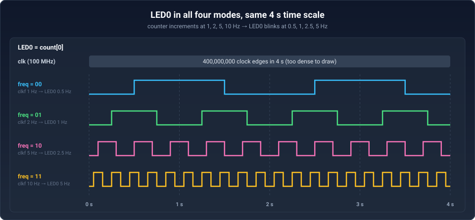
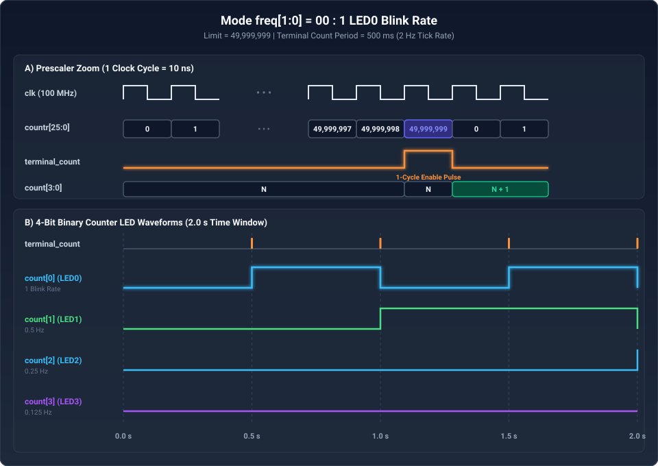
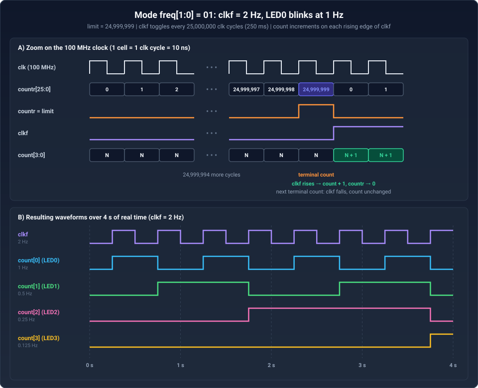
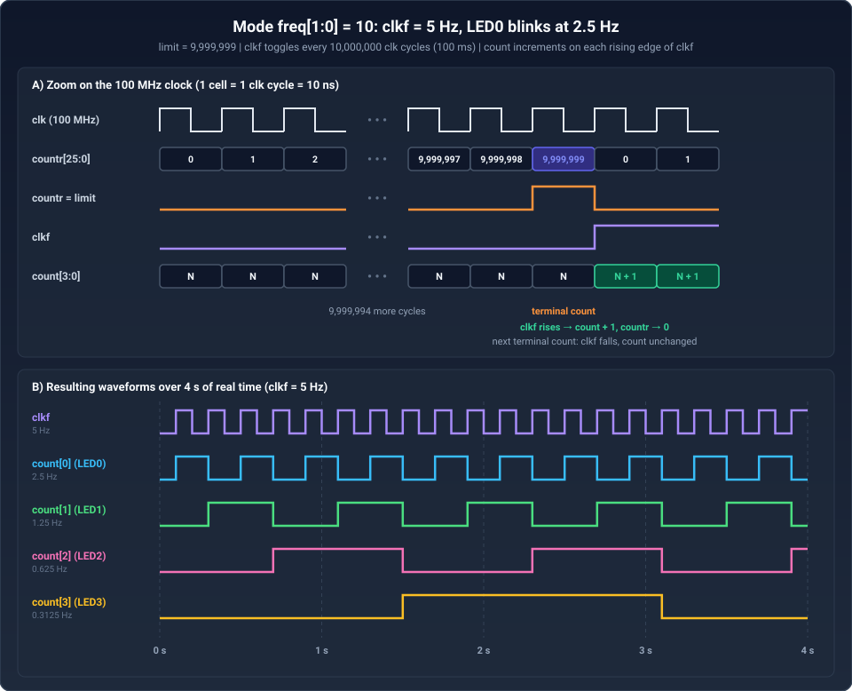
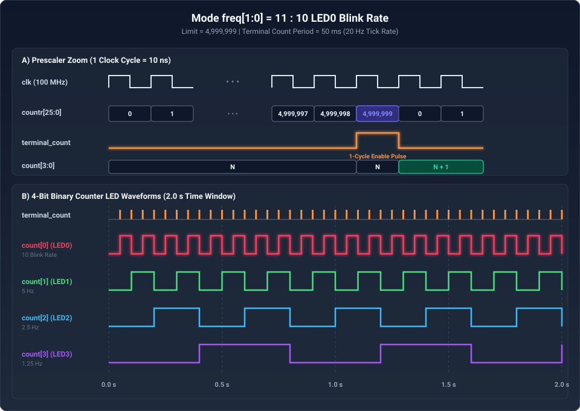

# Artix-7 LED Counter with Selectable Blink Speed


A Verilog design for the **Xilinx Artix-7 XC7A35T** FPGA that divides the on-board 100 MHz oscillator down to human-visible rates and drives a 4-bit binary counter on LEDs. Two switches select the speed: LED0 blinks at **1, 2, 5 or 10 Hz**.

---

## Contents
- [Demo Videos](#demo-videos)
- [Features](#features)
- [How the Clock Division Works](#how-the-clock-division-works)
- [Frequency Table](#frequency-table)
- [Waveforms](#waveforms)
  - [Speed Selection Overview](#speed-selection-overview)
  - [1 Hz Mode (`freq = 00`)](#1-hz-mode-freq--00)
  - [2 Hz Mode (`freq = 01`)](#2-hz-mode-freq--01)
  - [5 Hz Mode (`freq = 10`)](#5-hz-mode-freq--10)
  - [10 Hz Mode (`freq = 11`)](#10-hz-mode-freq--11)
- [Ports](#ports)
- [Build and Run](#build-and-run)
- [Repository Structure](#repository-structure)
- [License](#license)

---

## Demo Videos

| Mode | `freq[1:0]` | LED0 Blink Rate | Video |
| :---: | :---: | :---: | :---: |
| **1 Hz** | `00` | 1 Hz |  |
| **2 Hz** | `01` | 2 Hz |  |
| **5 Hz** | `10` | 5 Hz |  |
| **10 Hz** | `11` | 10 Hz |  |
| **All Speeds** | `00 → 01 → 10 → 11` | 1 → 2 → 5 → 10 Hz |  |

---

## Features
- Four selectable speeds from the 100 MHz board clock using slide switches (`freq[1:0]`).
- 26-bit prescaler counter to divide clock down to human-visible rates.
- 4-bit binary up-counter shown on the LEDs.
- Hardware verified on Xilinx Artix-7 FPGA board.

---

## How the Clock Division Works

The board oscillator runs at **100 MHz**, so one clock period is **10 ns**. That is far too fast to see on an LED, so the design counts clock cycles and toggles an internal divided clock signal `clkf` once every $N$ cycles.

```
100 MHz clk ──► [ 26-bit prescaler countr ] ──► terminal count ──► [ clkf toggle ] ──► [ 4-bit counter ] ──► LEDs
                     ▲                                                                       │
                     └───────────────────── limit chosen by freq[1:0] ───────────────────────┘
```

### Step by Step
1. `countr` increments by 1 on every rising edge of `clk`.
2. When `countr` reaches `limit`, it resets to 0 and toggles `clkf`.
3. On the rising edge of `clkf`, the 4-bit `count` register increments by 1.
4. `count[0]` (LED0) therefore toggles on every `clkf` edge, `count[1]` toggles every second one, and so on. Each bit is a divide-by-2 of the one below it.

### The Formula

$$\text{limit} + 1 = \frac{\text{CLK}_{\text{HZ}}}{\text{tick}_{\text{Hz}}}$$

Where $\text{tick}_{\text{Hz}} = 2 \times \text{LED0 blink frequency}$ (LED0 needs two ticks per blink: ON, then OFF).

For a **1 Hz LED0 blink**:
$$\text{tick} = 2\text{ Hz} \implies \text{limit} + 1 = \frac{100,000,000}{2} = 50,000,000 \implies \text{limit} = 49,999,999$$

---

## Frequency Table

All values are for the 100 MHz on-board oscillator (10 ns period).

| `freq[1:0]` | limit | Cycles per tick | Tick period | count increments at | LED0 blinks at | LED1 | LED2 | LED3 |
| :---: | :---: | :---: | :---: | :---: | :---: | :---: | :---: | :---: |
| `00` | `49,999,999` | 50,000,000 | 500 ms | 2 Hz | **1 Hz** | 0.5 Hz | 0.25 Hz | 0.125 Hz |
| `01` | `24,999,999` | 25,000,000 | 250 ms | 4 Hz | **2 Hz** | 1 Hz | 0.5 Hz | 0.25 Hz |
| `10` | `9,999,999`  | 10,000,000 | 100 ms | 10 Hz | **5 Hz** | 2.5 Hz | 1.25 Hz | 0.625 Hz |
| `11` | `4,999,999`  | 5,000,000  | 50 ms  | 20 Hz | **10 Hz** | 5 Hz | 2.5 Hz | 1.25 Hz |

The full 4-bit sequence (0 to 15) repeats every 16 ticks: 8 s, 4 s, 1.6 s and 0.8 s respectively.

---

## Waveforms

### Speed Selection Overview
Comparison of LED0 output across all four settings over the same 2-second time scale:



---

### 1 Hz Mode (`freq = 00`)
- **limit**: `49,999,999` (divide by 50,000,000 per tick)
- **Tick Period**: 500 ms (2 Hz)
- **LED0 Blink Rate**: 1 Hz



---

### 2 Hz Mode (`freq = 01`)
- **limit**: `24,999,999` (divide by 25,000,000 per tick)
- **Tick Period**: 250 ms (4 Hz)
- **LED0 Blink Rate**: 2 Hz



---

### 5 Hz Mode (`freq = 10`)
- **limit**: `9,999,999` (divide by 10,000,000 per tick)
- **Tick Period**: 100 ms (10 Hz)
- **LED0 Blink Rate**: 5 Hz



---

### 10 Hz Mode (`freq = 11`)
- **limit**: `4,999,999` (divide by 5,000,000 per tick)
- **Tick Period**: 50 ms (20 Hz)
- **LED0 Blink Rate**: 10 Hz



---

## Ports

| Port | Direction | Width | Description |
| :--- | :---: | :---: | :--- |
| `clk` | in | 1 | 100 MHz on-board oscillator |
| `freq` | in | 2 | Speed select (switches) |
| `count` | out | 4 | Binary counter, connect to LEDs |

---

## Build and Run

1. Create a Vivado project for the Artix-7 XC7A35T (e.g. Arty A7-35T or Basys 3).
2. Add `src/led.v` as a design source.
3. Add your board's `.xdc` from `constraints/constraints.xdc`.
4. Make sure the XDC contains the clock constraint:
   ```tcl
   create_clock -add -name sys_clk_pin -period 10.000 -waveform {0 5} [get_ports clk]
   ```
5. Run Synthesis, Implementation, then Generate Bitstream.
6. Program the board, set the `freq` switches and watch the LEDs.

---

## Repository Structure

```
Artix7_LED_Counter/
├── README.md                 # Project documentation & timing diagrams
├── LICENSE                   # MIT License
├── src/
│   └── led.v                 # Top Verilog module
├── constraints/
│   └── constraints.xdc       # Pin & clock constraints
├── docs/
│   ├── waveform_overview.svg # Comparison timing diagram
│   ├── waveform_1hz.svg      # 1 Hz mode timing diagram
│   ├── waveform_2hz.svg      # 2 Hz mode timing diagram
│   ├── waveform_5hz.svg      # 5 Hz mode timing diagram
│   └── waveform_10hz.svg     # 10 Hz mode timing diagram
└── videos/
    ├── 1hz.mp4               # 1 Hz demo video
    ├── 2hz.mp4               # 2 Hz demo video
    ├── 5hz.mp4               # 5 Hz demo video
    ├── 10hz.mp4              # 10 Hz demo video
    └── all.mp4               # All speeds demo video
```

---

## License

[MIT](LICENSE)
